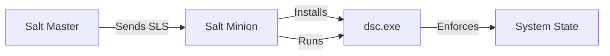

# SaltStack Integration with Microsoft DSC v3

Integrating SaltStack with DSC v3 allows you to leverage Salt's powerful orchestration and reporting while using DSC v3's modern, cross-platform resource management.

## Integration Architecture

SaltStack acts as the **Orchestrator**, while DSC v3 acts as the **Local Enforcer**.

## Setup Steps

### 1. Distribute DSC Configuration
Salt ensures the `.dsc.yaml` files are present on the minion.

### 2. Execute via Salt State
Use the `cmd.run` state to trigger DSC. Ideally, use `onlyif` or `unless` checks to ensure idempotency.

### 3. Capture Results
DSC v3 outputs JSON by default, which can be parsed by Salt or sent to a returner for centralized logging.
